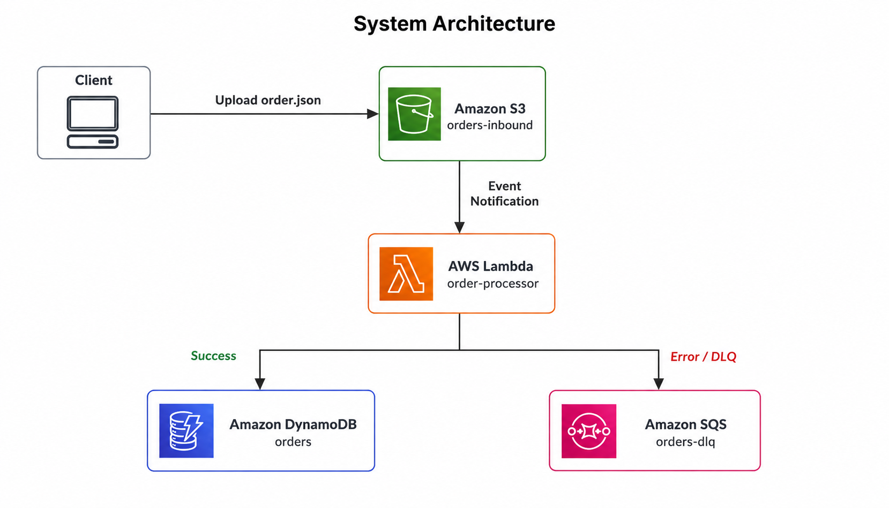
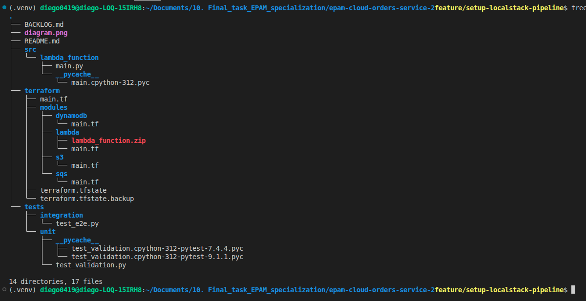

# Orders Processing Service - LocalStack & Terraform

An automated, serverless event-driven order processing service built with AWS services simulated locally via **LocalStack Pro**, provisioned using **Terraform**, and tested/deployed through **GitHub Actions**.

---

## 1. Project Overview & Architecture

This repository contains an end-to-end serverless data pipeline for distributed order processing. The entire infrastructure is defined as code (IaC) using Terraform and emulated locally using LocalStack to enable offline development and testing.

When an incoming order payload (JSON format) is uploaded to an Amazon S3 bucket, an Amazon S3 Event Notification automatically triggers an AWS Lambda function. The function validates the payload structure, extracts order details, and persists valid records to an Amazon DynamoDB table. Invalid payloads or execution failures are diverted to an Amazon SQS Dead-Letter Queue (DLQ).

---

## 2. Prerequisites

- Docker Desktop / Docker Engine (running).

- Python >= 3.10 and venv.

- Terraform CLI >= 1.5.0.

- AWS CLI v2.

---

## 3. Architecture Diagram


### Infrastructure Components
- **S3 Bucket (orders-inbound)**: Stores incoming JSON order files.
- **S3 Event Notification**: Triggers the Lambda function upon *s3:ObjectCreated:* events.
- **AWS Lambda (order-processor)**: Python 3.12 runtime function executing business and validation logic.
- **DynamoDB Table (orders)**: NoSQL database storing valid order records *(artition Key: order_id)*.
- **SQS Queue (orders-dlq)**: Dead-Letter Queue handling corrupted or unprocessable messages.
- **IAM Roles & Policies**: Least-privilege IAM policies governing cross-service communication.

---

## 4. Project Structure


---

## 5. Local Setup & Deployment Guide

Step 1: Clone the Repository & Activate Environment

```bash
git clone <YOUR REPOSITORY_URL>
cd epam-cloud-orders-service-2
python3 -m venv .venv
source .venv/bin/activate
pip install -r requirements.txt
```

Step 2: Start LocalStack

Ensure Docker is running, then start LocalStack in detached mode:

```bash
docker compose up -d
```

Verify service health on port 4566:
```bash
curl http://localhost:4566/_localstack/health
```

Step 3: Terraform Provider Configuration

Ensure terraform/main.tf explicitly routes service endpoints to LocalStack using mock credentials:

```terraform
terraform {
  required_version = ">= 1.5.0"
  required_providers {
    aws = {
      source  = "hashicorp/aws"
      version = "~> 5.0"
    }
  }
}

provider "aws" {
  region                      = "us-east-1"
  access_key                  = "mock_access_key"
  secret_key                  = "mock_secret_key"
  skip_credentials_validation = true
  skip_metadata_api_check     = true
  skip_requesting_account_id  = true

  endpoints {
    dynamodb = "http://localhost:4566"
    iam      = "http://localhost:4566"
    lambda   = "http://localhost:4566"
    s3       = "http://s3.localhost.localstack.cloud:4566"
    sqs      = "http://localhost:4566"
    sts      = "http://localhost:4566"
  }
}
```

Step 4: Provision Infrastructure

```bash
cd terraform
terraform init
terraform apply -auto-approve
```

---

## 6. Verification & End-to-End Testing

1. Resource Verification Commands

Verify that all AWS resources were successfully created in LocalStack:

```bash
# List S3 Buckets
aws --endpoint-url=http://localhost:4566 s3 ls

# List DynamoDB Tables
aws --endpoint-url=http://localhost:4566 dynamodb list-tables

# List Lambda Functions
aws --endpoint-url=http://localhost:4566 lambda list-functions

# List SQS Queues
aws --endpoint-url=http://localhost:4566 sqs list-queues
```

2. Manual End-to-End (E2E) Test
Create a sample order.json payload:

```JSON
{
  "order_id": "ORD-2026-001",
  "customer": "Diego",
  "amount": 250.00,
  "status": "APPROVED"
}
```

Upload the file to the S3 bucket:

```bash
aws --endpoint-url=http://localhost:4566 s3 cp order.json s3://orders-inbound/order.json
```

Query the DynamoDB table to confirm data insertion:

```bash
aws --endpoint-url=http://localhost:4566 dynamodb scan --table-name orders
```

Check Lambda CloudWatch execution logs:

```bash
aws --endpoint-url=http://localhost:4566 logs tail /aws/lambda/order-processor
```

3. Automated Test Suite Execution
Run unit and integration tests using pytest:

```bash
# Run unit tests
pytest tests/unit/

# Run end-to-end integration tests
pytest tests/integration/
```

## 7. Future Architectural Improvements
- Serverless Encryption (AWS KMS): Enable server-side encryption at rest for S3 buckets and DynamoDB tables using customer-managed keys (aws_kms_key).

- Observability & Alerting: Add CloudWatch Alarms for SQS DLQ depth monitoring and Lambda execution errors.

- CI/CD Automation: Implement GitHub Actions pipelines to automate terraform fmt, terraform validate, unit testing, and automated deployments.

- Remote State Management: Configure an S3 remote backend with DynamoDB state locking to support multi-developer workflows.